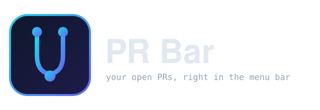

<p align="center">
  
</p>

<p align="center">
  <a href="https://djalmaaraujo.github.io/pr-menubar/">djalmaaraujo.github.io/pr-menubar</a>
</p>

<p align="center">
  <strong>Your open pull requests, live in the menu bar.</strong><br>
  Reads straight from the <code>gh</code> CLI on your machine — no token of its own, no server, no browser cookie.
</p>

<p align="center">
  
  
  
  
</p>

<p align="center">
  
</p>

---

## What it does

You already know your open PRs — `gh search prs --author=@me --state=open` lists them. PR Menubar just runs that for you every 60 seconds and keeps the result one click away in the menu bar.

Click the icon, see every PR you have open across the orgs and accounts you can reach. Each row shows its state, title, number, repository, and CI status. Click a row to open the PR in your browser. That's the whole app.

No cookies, no OAuth flow of its own, no server. It shells out to the `gh` binary you already have installed and authenticated — same source of truth as the CLI.

- **One row per PR** — state dot (draft / approved / changes requested / open), title, `#number`, `owner/repo`, and a CI rollup glyph (pass / fail / pending / none).
- **Filter by org or account** — a dropdown auto-populated from the orgs you can access, plus your personal account and an "All" option. Orgs with private membership still show up, because PR Menubar also picks up any owner that appears in your actual PRs.
- **Stacked PRs, drawn as a tree** — when one PR is based on another's branch, the chain renders indented with a vertical guide, so a stack is obvious at a glance.
- **Count in the menu bar** — the icon carries a badge with the number of open PRs in the current filter. Hidden when it's zero.
- **Clear failure state** — if `gh` isn't installed, isn't logged in, or you're offline, the popover shows the exact fix and a Retry button instead of spinning forever, and the menu bar icon swaps to a warning triangle.
- **Refreshes on its own** — every 60 seconds, plus a manual refresh button whenever you want it now.

## Dependencies

**Runtime**

- **[GitHub CLI](https://cli.github.com) (`gh`)** — required. PR Menubar shells out to it for every call, so install it and run `gh auth login` once.
- **macOS 13 or later**, Apple silicon.

**Bundled with macOS — no third-party libraries**

- **SwiftUI** and **AppKit** — the whole UI.

**Build only**

- **Xcode Command Line Tools** (`xcode-select --install`) — for `swiftc`.

No Swift packages, no CocoaPods, nothing vendored. Two Swift source files compiled directly.

## Install

### Homebrew (recommended)

```bash
brew install djalmaaraujo/tap/pr-menubar
```

### Build from source

```bash
git clone https://github.com/djalmaaraujo/pr-menubar.git
cd pr-menubar/app
./build.sh
```

Compiles, packages `PRMenubar.app`, ad-hoc signs it, and opens it. Drag `build/PRMenubar.app` into `/Applications` to keep it around.

## How it works

PR Menubar makes two kinds of `gh` calls and never talks to GitHub any other way.

```
┌─────────────────────────────┐
│  MenuBarExtra (SwiftUI)     │
│                              │
│  every 60s ──► gh search prs --author=@me --state=open [--owner=ORG]
│                     │        │
│  for each PR ──► gh pr view <n> --repo <owner/repo> --json …statusCheckRollup
│                     │        │
│  build tree ◄───────┘        │
│  → rows + CI glyphs + count  │
└─────────────────────────────┘
```

`gh search prs` enumerates your open PRs but doesn't carry CI or branch data, so PR Menubar enriches each one with `gh pr view` (run a few at a time to stay responsive). The branch names — `headRefName` and `baseRefName` — are what let it detect a stack: within a repo, PR *B* sits on PR *A* when B's base is A's head. `statusCheckRollup` collapses to one of pass / fail / pending / none per row.

The org dropdown is the union of `gh api user/orgs`, your personal account, and any owner seen in your results — the last part is what recovers orgs whose membership is private.

## Privacy

Nothing leaves your machine except the GitHub API calls `gh` already makes on your behalf, with the credentials `gh` already holds. PR Menubar has no token, no server, no analytics, and stores nothing beyond your selected filter in `UserDefaults`.

## Why

I wanted my open PRs where I glance a hundred times a day — the menu bar — without another Electron app, another login, or another token to manage. `gh` already knows everything; this is a thin native window onto it.

Modeled after [claude-usage-menubar](https://github.com/djalmaaraujo/claude-usage-menubar): single Swift file, `swiftc` build, zero runtime dependencies, same palette.

## License

MIT © Djalma Araújo
